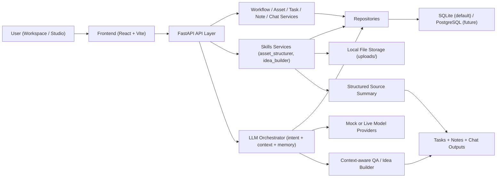

# SparkHunter（CUResearch.ai 科研工作台）

SparkHunter 是一个面向科研工作流的全栈项目，目标是把“资料阅读 + 对话思考 + 任务沉淀”串成一个可执行闭环。  
当前版本包含：

- `backend/`：Python 3 + FastAPI 后端
- `frontend/`：React + TypeScript + Vite 前端

核心能力：

- Workflow / Assets / Chat / Tasks / Notes 管理
- 资料结构化（`Structure Sources`）
- Idea Builder（构思引导流程）
- Mock / Live 模型切换与用户级模型配置


核心思想：

- 问题是不是清楚
- 动机是不是成立
- 假设是不是可检验
- 证据是不是足够
- 实验是不是在回答关键问题
- 结果该如何解释
- 下一步是继续、修正，还是止损

---

## 0. 架构图



---

## 0.1 功能截图位

> 说明：以下是占位图片路径。你把真实截图放到 `docs/assets/` 后，README 会直接显示。

### Workspace 页面


### Studio 三栏页面（Sources / Chat / Outputs）


### Settings（模型配置）


### Structure Sources + Idea Builder


---

## 0.2 快速演示 GIF

> 建议录制 30~60 秒，覆盖完整闭环：上传素材 -> Structure Sources -> Chat 提问 -> 生成任务草稿。


推荐录制脚本：

1. 创建 workflow 并进入 Studio  
2. 上传 1~2 个 source 并勾选  
3. 点击 `Structure Sources`  
4. 在 Chat 里提问“这篇论文讲了什么”  
5. 展示 Idea Builder 给出的方向选择  
6. 点击 `Generate Tasks`，展示右栏任务草稿

---

## 1. 项目结构

```text
SparkHunter/
  backend/    # FastAPI 后端
  frontend/   # React 前端
  docs/
    assets/   # README 截图与 GIF 资源
```

更详细的模块说明请看：

- `backend/README.md`
- `frontend/README.md`

---

## 2. 环境要求

推荐环境：

- Python 3.11+（当前本地也可用 3.13）
- Node.js 18+
- npm 9+

---

## 3. 安装流程

### 3.1 安装后端依赖

```bash
cd /Users/minhaoliu/Desktop/project/SparkHunter/backend
python -m venv .venv
source .venv/bin/activate
pip install --upgrade pip
pip install -r requirements.txt
cp .env.example .env
```

### 3.2 安装前端依赖

```bash
cd /Users/minhaoliu/Desktop/project/SparkHunter/frontend
npm install
cp .env.example .env
```

---

## 4. 启动流程

### 4.1 启动后端

```bash
cd /Users/minhaoliu/Desktop/project/SparkHunter/backend
source .venv/bin/activate
uvicorn app.main:app --reload
```

后端地址：

- `http://127.0.0.1:8000`
- Swagger: `http://127.0.0.1:8000/docs`

### 4.2 启动前端

```bash
cd /Users/minhaoliu/Desktop/project/SparkHunter/frontend
npm run dev
```

前端地址：

- `http://localhost:5173`
- `http://127.0.0.1:5173`

---

## 5. 调试流程（推荐）

### 5.1 基础联调

1. 启动后端与前端
2. 进入 Workspace 创建一个 workflow
3. 进入 Studio 上传 source
4. 勾选资料后点击 `Structure Sources`
5. 在 Chat 中提问（例如“这篇论文讲了什么”）
6. 检查右侧 Tasks/Notes 是否联动更新

### 5.2 模型调试（Mock / Live）

在前端 Chat 顶部切换：

- `Mock`：本地演示/无 key 场景
- `Live`：走后端配置的真实模型

模型配置入口在前端右上角 `Settings`。  
注意：密钥由后端持久化，前端不做本地明文长期存储。

### 5.3 接口调试

可用 Swagger 直接验证接口：

- `POST /api/chat/send`
- `POST /api/skills/run-asset`
- `POST /api/idea-builder/start`
- `POST /api/idea-builder/respond`

---

## 6. 测试与构建

### 6.1 后端测试

```bash
cd /Users/minhaoliu/Desktop/project/SparkHunter/backend
PYTHONPATH=. ./.venv/bin/pytest
```

### 6.2 前端构建检查

```bash
cd /Users/minhaoliu/Desktop/project/SparkHunter/frontend
npm run build
```

---

## 7. 常见问题

### 7.1 `python3.11: command not found`

本机如果没有 `python3.11`，可直接用 `python` 创建虚拟环境：

```bash
python -m venv .venv
```

### 7.2 上传 PDF 报 `No module named pypdf`

说明后端依赖未完整安装，重新执行：

```bash
pip install -r requirements.txt
```

### 7.3 Live 模式无响应

优先检查：

- Settings 中 provider/model/base_url/api_key 是否正确
- 后端日志是否有 401/403/429
- 前端是否误切回 `Mock`

---

## 8. 当前版本说明

当前版本是科研工作台 MVP，重点是：

- 分层清晰（API / Service / Repository / LLM / Storage）
- 能跑通核心闭环（source -> chat -> task/note）
- 方便后续多人协作扩展

可扩展方向：

- 更强的上下文检索与引用
- 更完整的 Idea Builder 状态管理
- 真实 deep research 与多技能编排
